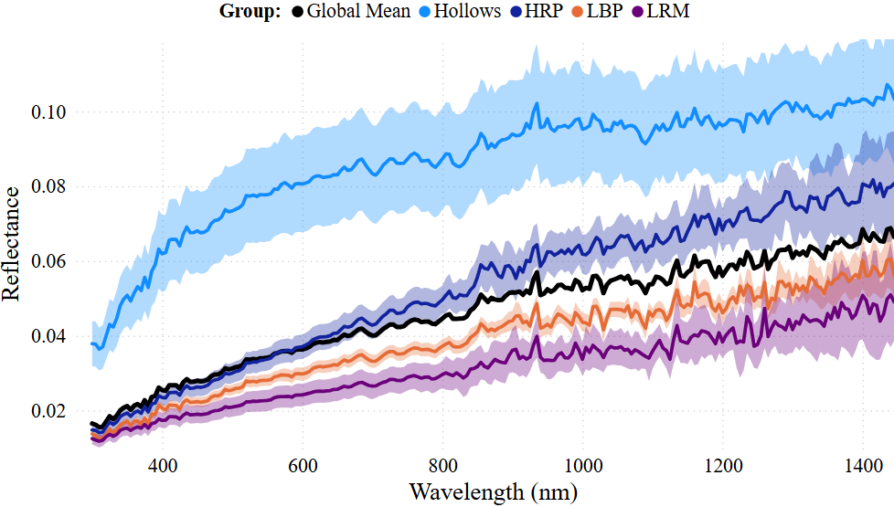
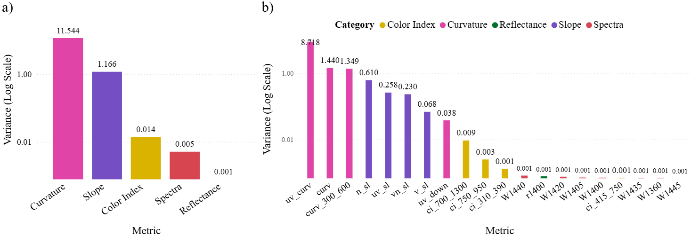
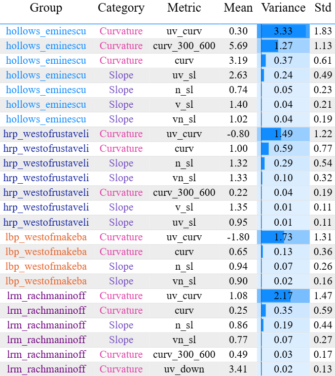
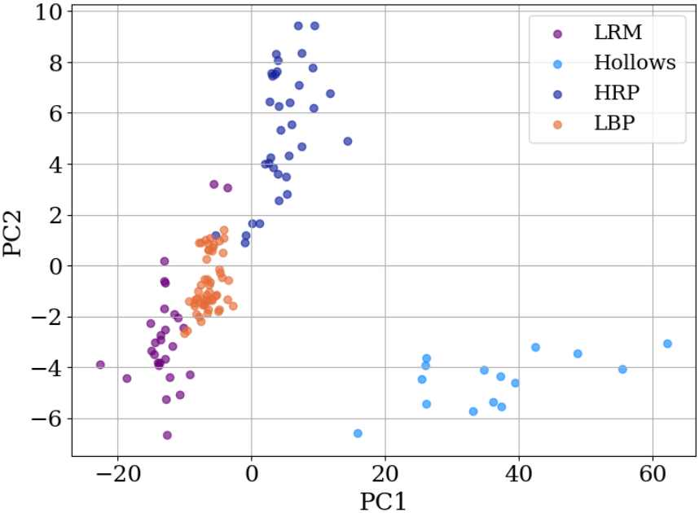
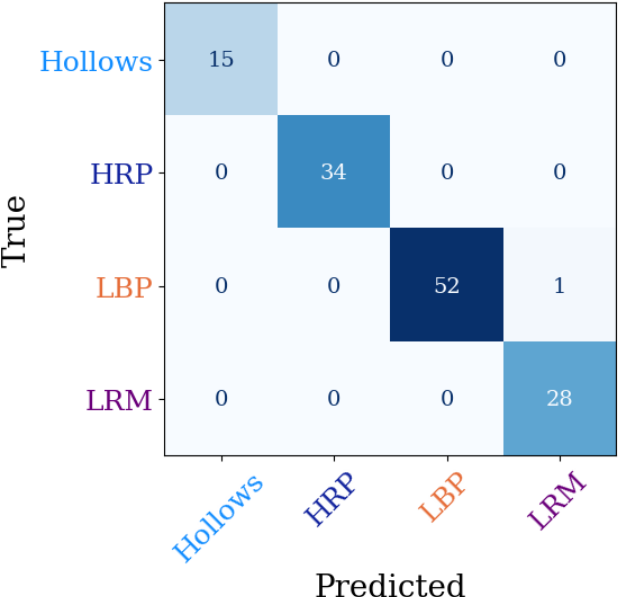
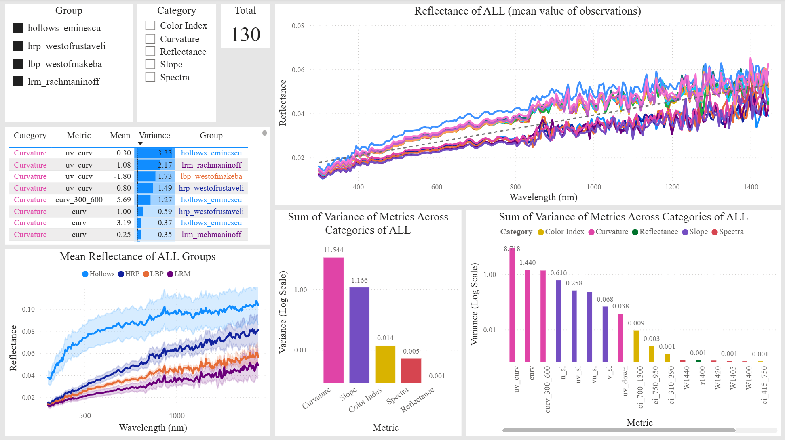
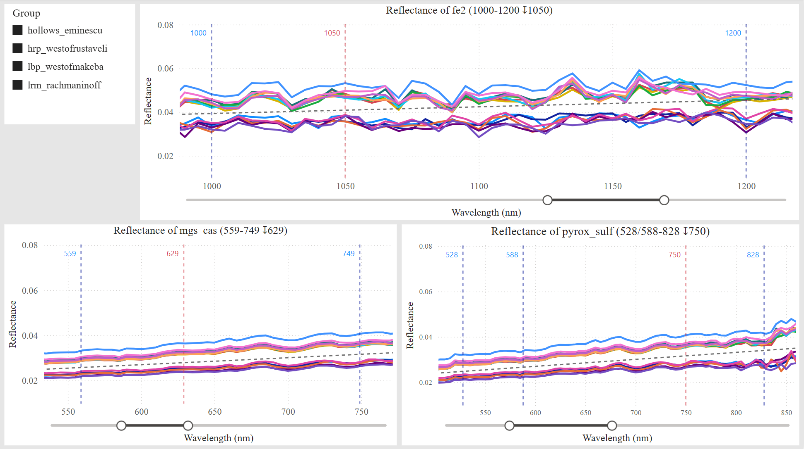

# Mercury VIS–NIR Spectral Metrics, PCA, and Power BI Dashboard

## Summary
This project presents a reproducible methodology to compute and evaluate VIS–NIR spectral metrics from MESSENGER MASCS/VIRS reflectance spectra of Mercury surface units. The analysis was applied to 130 spectra sampling four representative Mercury surface units (LRM, HRP, LBP, and Hollows), and metric relevance was evaluated through: (i) descriptor-based feature engineering, including curvature, slopes, color indices, reflectance values, point-by-point spectral channels, and diagnostic band-depth parameters; (ii) variance-based statistical ranking to assess the individual discriminatory power of the metrics; (iii) Principal Component Analysis (PCA) on standardized features to examine multivariate structure and separability; (iv) supervised multi-class classification using the highest-ranked descriptors to test whether the extracted metrics effectively support surface-unit discrimination. The workflow enables transparent metric prioritization, comparative evaluation, and interactive exploration through a Power BI dashboard, and it is designed to be extendable to larger Mercury datasets and future planetary reflectance studies.

  
  

---

## Findings
- **Curvature metrics** dominate the variance-based ranking and provide the strongest single-metric discrimination, with **ultraviolet curvature** (`uv_curv`) identified as the most effective individual descriptor. Global Curvature (`curv`) and UVVIS Curvature (`curv_300_600`) also rank prominently, confirming that continuum shape is the most informative property for separating Mercury surface units in this dataset.
- **Slope metrics** exhibit good discriminatory behavior overall. VIS Slope (`v_sl`) and VISNIR Slope (`vn_sl`) are present across all four units and show moderately distinctive values, while UV Slope (`uv_sl`) is particularly distinctive in Hollows. However, slope-based overlap between Mercury terrains has also been reported in previous studies, so slopes are best interpreted together with curvature and color metrics.
- **Color indices** rank ahead of absolute reflectance and most channel-by-channel spectral values, indicating that reflectance ratios capture more inter-unit variability than raw reflectance alone. Among them, the **NIR Color Index** (`ci_700_1300`) contributes more strongly than the **VISNIR Color Index** (`ci_750_950`), while the **UV Color Index** (`ci_310_390`) is weaker and the **VIS Color Index** is the least prominent in the variance-based ranking.
- **Reflectance-based and channel-by-channel descriptors** are less dominant overall. Although some individual near-infrared channels appear in the rankings, they are not considered primary discriminative indicators because this spectral region may be affected by instrumental noise, especially near the upper limit of the detector range.
- **PCA confirms strong multivariate separation** in reduced space. Hollows form a compact and clearly isolated cluster, while the plains units show only minor overlap. PC1 explains **90.94%** of the total variance and PC2 explains an additional **5.72%**.
- **PCA loadings** show that the reduced-space structure is dominated by slope, color-index, and curvature-related metrics. The top contributors by total loading contribution (`|PC1| + |PC2|`) are: `vn_sl`, `ci_415_750`, `ci_700_1300`, `n_sl`, `ci_750_950`, `uv_down`, `v_sl`, `curv_300_600`, `W1415`, and `W1365`. Even so, the main interpretation focuses on broader descriptors such as slopes, curvature, and color indices.
- **Band-depth metrics** show limited effectiveness in this MASCS/VIRS dataset. Only **Mg S CaS** and **Pyroxene/Silicates - Fe²⁺** yield positive detections at the adopted threshold (`BD_th = 0.01`), and these detections are weak, visually ambiguous, and highly sensitive to threshold choice. All positive detections disappear when the threshold is increased to **0.069** for Mg S CaS and **0.133** for **Pyroxene/Silicates - Fe²⁺**. No pyroxene-sulfure band depths are detected in any unit at the adopted threshold.
- A **supervised multi-class classification** test using the highest-ranked descriptors (`uv_curv`, `curv`, `curv_300_600`, `n_sl`, `uv_sl`, `vn_sl`, `v_sl`, `uv_down`, `ci_700_1300`, `ci_750_950`, `ci_310_390`, and `ci_415_750`) achieved a **balanced accuracy of 0.9953** and an overall accuracy of **0.9923**, demonstrating near-complete separability among the four mapped surface units. Misclassification is minimal and occurs mainly between **LBP** and **LRM**, while **Hollows** and **HRP** are classified without error.
- Overall, the study delivers a reproducible metric-evaluation framework that combines **variance-based ranking, PCA, and supervised classification** to prioritize robust, interpretable descriptors for Mercury surface-unit discrimination. The methodology is readily extendable to larger Mercury datasets and future VIS–NIR observations.

  

  

  

  

---

## Dashboard
The repository also includes a Power BI dashboard for interactive exploration of spectral metrics and Mercury surface units. The dashboard allows quick inspection of curvature, slopes, color indices, reflectance behavior, and other derived descriptors, providing a visual complement to the statistical and PCA-based analysis.

  

  

---

## What is included in this repository
- **Jupyter Notebook (main workflow)**
  - `Code_Mercury.ipynb`  
  Runs the full methodology end-to-end, including feature computation and PCA.
- **Input database**
  - `Database_Mercury.csv`  
  Required input dataset for the notebook.
- **Processed / exported database (Power BI input)**
  - `Database_Mercury_Features.csv`  
  Exported by the notebook and used by the Power BI report.
- **Power BI dashboard**
  - `Mercury.pbix`  
  Interactive report that requires the exported CSV above to refresh.
- **The Article**
  - `RMxAA_Mercury-AnaOjeda.pdf`  
  Accepted for publication in the *Revista Mexicana de Astronomía y Astrofísica (RMxAA)*.

> **Important:** The Power BI dashboard depends on the CSV exported by the notebook, but I attached the CSVs needed in any case. 

---

## Workflow (recommended order)
1. **Run the notebook** (`Code_Mercury.ipynb`) using the input dataset `Database_Mercury.csv`.
2. The notebook **exports** the processed dataset:  
   `Database_Mercury_Features.csv`
3. **Open the Power BI file** (`Mercury.pbix`) and **Refresh** to load the exported CSV.

---

## Requirements
### Python
- Python **3.9+** recommended (3.10/3.11 also OK).

### Python packages
Install the minimal dependencies needed to run the notebook (included in the first steps). 

### Power BI
- **Power BI Desktop** (Windows) to open `Mercury.pbix` and refresh the data. `Database_Mercury_Features.csv` needed to run the Power BI report.

---

## Contact

**Ana V. Ojeda Vera** PhD candidate at CITEDI-IPN, México. 
Doctoral Student in Data Science  
CITEDI-IPN  
Email: **aojeda@citedi.mx**
